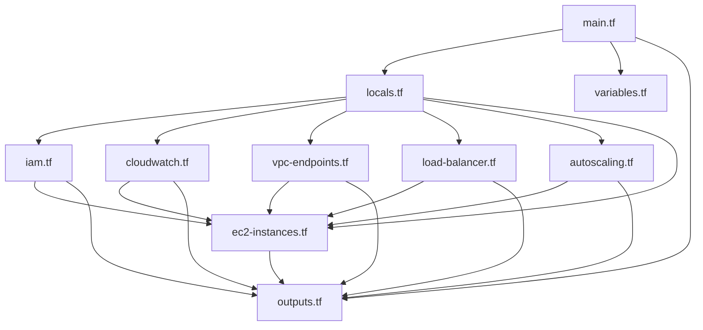

# Terraform AWS EC2 Instance Wrapper - File Structure

This document explains the organized file structure of the Terraform AWS EC2 Instance Wrapper module.

## 📁 File Organization

The module has been reorganized into separate files for better maintainability, readability, and modularity:

### 🔧 Core Configuration Files

| File | Purpose | Contents |
|------|---------|----------|
| `main.tf` | Main entry point | Module orchestration and documentation |
| `variables.tf` | Input variables | All variable definitions and validation |
| `outputs.tf` | Output values | All module outputs |
| `versions.tf` | Version constraints | Terraform and provider versions |
| `templates.tf` | Dynamic templates | Template factory and dynamic template creation |

### 🏗️ Resource-Specific Files

| File | Purpose | Contents |
|------|---------|----------|
| `locals.tf` | Local variables & data sources | Data processing, locals, and data sources |
| `iam.tf` | IAM resources | Instance profiles for existing IAM roles |
| `cloudwatch.tf` | CloudWatch & EventBridge | Log groups, EventBridge rules, and targets |
| `vpc-endpoints.tf` | VPC endpoints | VPC endpoints and associated security groups |
| `load-balancer.tf` | Load balancer resources | ALB, target groups, listeners, and security groups |
| `autoscaling.tf` | Auto scaling | Auto Scaling Groups |
| `ec2-instances.tf` | EC2 instances | Main EC2 instance module calls |

## 📋 Detailed File Descriptions

### `main.tf`
- **Purpose**: Main entry point and documentation
- **Contains**: 
  - Module overview and documentation
  - File organization explanation
  - Placeholder for additional resources
- **Usage**: Entry point for the module

### `variables.tf`
- **Purpose**: Define all input variables
- **Contains**:
  - `defaults` variable (default configuration)
  - `instances` variable (instance-specific configurations)
  - Validation blocks for input validation
- **Usage**: Configure module behavior

### `outputs.tf`
- **Purpose**: Expose module outputs
- **Contains**:
  - EC2 instance outputs (IDs, IPs, etc.)
  - Enhanced feature outputs (CloudWatch, ALB, ASG, etc.)
  - Configuration summaries
- **Usage**: Access created resources

### `locals.tf`
- **Purpose**: Data processing and local variables
- **Contains**:
  - `merged_instances`: Merge defaults with instance configs
  - `enabled_instances`: Filter enabled instances
  - Data sources for regions, subnets, etc.
- **Usage**: Internal data processing

### `iam.tf`
- **Purpose**: IAM-related resources
- **Contains**:
  - `aws_iam_instance_profile`: Instance profiles for existing roles
- **Usage**: Handle IAM role and instance profile creation

### `cloudwatch.tf`
- **Purpose**: CloudWatch and EventBridge resources
- **Contains**:
  - `aws_cloudwatch_log_group`: Log groups for instances
  - `aws_cloudwatch_event_rule`: Scheduling rules
  - `aws_cloudwatch_event_target`: Event targets
- **Usage**: Monitoring and scheduling features

### `vpc-endpoints.tf`
- **Purpose**: VPC endpoint resources
- **Contains**:
  - `aws_vpc_endpoint`: VPC endpoints for AWS services
  - `aws_security_group`: Security groups for VPC endpoints
- **Usage**: Private connectivity to AWS services

### `load-balancer.tf`
- **Purpose**: Load balancer infrastructure
- **Contains**:
  - `aws_lb`: Application Load Balancers
  - `aws_lb_target_group`: Target groups
  - `aws_lb_listener`: Load balancer listeners
  - `aws_security_group`: ALB security groups
- **Usage**: Load balancing and traffic distribution

### `autoscaling.tf`
- **Purpose**: Auto scaling resources
- **Contains**:
  - `aws_autoscaling_group`: Auto Scaling Groups
- **Usage**: Automatic scaling based on demand

### `ec2-instances.tf`
- **Purpose**: Main EC2 instance creation
- **Contains**:
  - `module "ec2_instance"`: Calls to the original EC2 module
- **Usage**: Create and configure EC2 instances

### `templates.tf`
- **Purpose**: Dynamic template system
- **Contains**:
  - Template factory function
  - Predefined pattern configurations
  - Dynamic template generation
  - Variable substitution logic
- **Usage**: Create reusable templates based on user input

## 🔄 Dependencies Between Files



## 🎯 Benefits of This Structure

### 1. **Maintainability**
- Each file has a single responsibility
- Easy to locate and modify specific resources
- Clear separation of concerns

### 2. **Readability**
- Smaller, focused files
- Logical grouping of related resources
- Better code organization

### 3. **Modularity**
- Can selectively include/exclude features
- Easy to extend with new resources
- Clear dependency relationships

### 4. **Collaboration**
- Multiple developers can work on different files
- Reduced merge conflicts
- Clear ownership of different components

### 5. **Testing**
- Can test individual components
- Easier to mock dependencies
- Better unit testing capabilities

## 🚀 Usage Examples

### Basic Usage (All Files)
```hcl
module "ec2_instances" {
  source = "./terraform-aws-ec2-instance-wrapper"
  
  defaults = {
    instance_type = "t3.micro"
    # ... other defaults
  }
  
  instances = {
    web = {
      name = "web-server"
      subnet_id = "subnet-12345678"
      # ... instance config
    }
  }
}
```

### Selective Feature Usage
You can comment out or remove files for features you don't need:

```hcl
# For basic instances only (no enhanced features):
# - Keep: main.tf, variables.tf, outputs.tf, locals.tf, ec2-instances.tf
# - Remove: iam.tf, cloudwatch.tf, vpc-endpoints.tf, load-balancer.tf, autoscaling.tf

# For instances with monitoring only:
# - Keep: main.tf, variables.tf, outputs.tf, locals.tf, cloudwatch.tf, ec2-instances.tf
# - Remove: iam.tf, vpc-endpoints.tf, load-balancer.tf, autoscaling.tf
```

## 🔧 Customization

### Adding New Resources
1. Create a new `.tf` file for the resource type
2. Add the resource definition
3. Update `outputs.tf` with new outputs
4. Update this documentation

### Modifying Existing Resources
1. Locate the appropriate `.tf` file
2. Make your changes
3. Test the modifications
4. Update documentation if needed

### Extending the Module
1. Add new variables to `variables.tf`
2. Add new resources to appropriate `.tf` files
3. Add new outputs to `outputs.tf`
4. Update `locals.tf` if needed
5. Update documentation

## 📝 Best Practices

### File Naming
- Use descriptive, lowercase names
- Separate words with hyphens
- Keep names short but clear

### Resource Organization
- Group related resources in the same file
- Use consistent naming conventions
- Add clear comments and documentation

### Dependencies
- Keep dependencies explicit and clear
- Use data sources for external dependencies
- Document cross-file dependencies

### Testing
- Test each file independently when possible
- Use consistent testing patterns
- Document test scenarios

## 🔍 Troubleshooting

### Common Issues
1. **Missing Dependencies**: Ensure all required files are present
2. **Variable Conflicts**: Check for duplicate variable definitions
3. **Output Errors**: Verify all referenced resources exist
4. **State Conflicts**: Use `terraform plan` to identify issues

### Debugging Tips
1. Use `terraform validate` to check syntax
2. Use `terraform plan` to see resource changes
3. Check file dependencies and references
4. Verify variable and output definitions

This organized structure makes the module more maintainable, extensible, and easier to understand for both developers and users.
