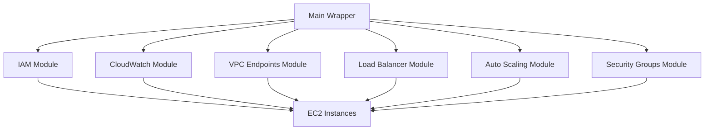

# Modular Architecture - Terraform AWS EC2 Instance Wrapper

## 🏗️ **Overview**

The Terraform AWS EC2 Instance Wrapper has been restructured into a **modular architecture** where different resource types are organized into separate, focused modules. This approach provides better maintainability, reusability, and separation of concerns.

## 📁 **Directory Structure**

```
terraform-aws-ec2-instance-wrapper/
├── modules/
│   ├── iam/
│   │   ├── main.tf
│   │   ├── variables.tf
│   │   └── outputs.tf
│   ├── cloudwatch/
│   │   ├── main.tf
│   │   ├── variables.tf
│   │   └── outputs.tf
│   ├── vpc-endpoints/
│   │   ├── main.tf
│   │   ├── variables.tf
│   │   └── outputs.tf
│   ├── load-balancer/
│   │   ├── main.tf
│   │   ├── variables.tf
│   │   └── outputs.tf
│   ├── autoscaling/
│   │   ├── main.tf
│   │   ├── variables.tf
│   │   └── outputs.tf
│   └── security-groups/
│       ├── main.tf
│       ├── variables.tf
│       └── outputs.tf
├── main.tf
├── variables.tf
├── outputs.tf
├── locals.tf
├── templates.tf
└── ec2-instances.tf
```

## 🎯 **Module Descriptions**

### **1. IAM Module (`modules/iam/`)**
**Purpose**: Handles IAM instance profiles for existing IAM roles

**Resources**:
- `aws_iam_instance_profile` - Instance profiles for existing roles

**Key Features**:
- Creates instance profiles for existing IAM roles
- Configurable naming and tagging
- Support for name prefixes

**Usage**:
```hcl
module "iam" {
  source = "./modules/iam"
  
  instances = local.enabled_instances
  name_prefix = var.name_prefix
  common_tags = var.common_tags
}
```

### **2. CloudWatch Module (`modules/cloudwatch/`)**
**Purpose**: Manages CloudWatch logs and EventBridge scheduling

**Resources**:
- `aws_cloudwatch_log_group` - Log groups for instances
- `aws_cloudwatch_event_rule` - Scheduling rules
- `aws_cloudwatch_event_target` - Event targets
- `aws_iam_role` - EventBridge roles
- `aws_iam_role_policy` - EventBridge policies

**Key Features**:
- Automatic log group creation
- Instance scheduling (start/stop)
- Configurable retention and monitoring

**Usage**:
```hcl
module "cloudwatch" {
  source = "./modules/cloudwatch"
  
  instances = local.enabled_instances
  name_prefix = var.name_prefix
  common_tags = var.common_tags
}
```

### **3. VPC Endpoints Module (`modules/vpc-endpoints/`)**
**Purpose**: Creates VPC endpoints and associated security groups

**Resources**:
- `aws_vpc_endpoint` - VPC endpoints for AWS services
- `aws_security_group` - Security groups for VPC endpoints

**Key Features**:
- Private connectivity to AWS services
- Configurable endpoint types
- Security group management

**Usage**:
```hcl
module "vpc_endpoints" {
  source = "./modules/vpc-endpoints"
  
  instances = local.enabled_instances
  name_prefix = var.name_prefix
  common_tags = var.common_tags
}
```

### **4. Load Balancer Module (`modules/load-balancer/`)**
**Purpose**: Manages Application Load Balancers and target groups

**Resources**:
- `aws_lb` - Application Load Balancers
- `aws_lb_target_group` - Target groups
- `aws_lb_listener` - Load balancer listeners
- `aws_security_group` - ALB security groups

**Key Features**:
- Application Load Balancer creation
- Health checks and target groups
- Configurable protocols and ports

**Usage**:
```hcl
module "load_balancer" {
  source = "./modules/load-balancer"
  
  instances = local.enabled_instances
  name_prefix = var.name_prefix
  common_tags = var.common_tags
}
```

### **5. Auto Scaling Module (`modules/autoscaling/`)**
**Purpose**: Handles Auto Scaling Groups and scaling policies

**Resources**:
- `aws_autoscaling_group` - Auto Scaling Groups
- `aws_autoscaling_policy` - Scaling policies
- `aws_cloudwatch_metric_alarm` - Scaling alarms

**Key Features**:
- Auto Scaling Group management
- CPU-based scaling policies
- CloudWatch alarms for scaling

**Usage**:
```hcl
module "autoscaling" {
  source = "./modules/autoscaling"
  
  instances = local.enabled_instances
  name_prefix = var.name_prefix
  common_tags = var.common_tags
}
```

### **6. Security Groups Module (`modules/security-groups/`)**
**Purpose**: Creates and manages instance security groups

**Resources**:
- `aws_security_group` - Instance security groups

**Key Features**:
- Dynamic ingress/egress rules
- Configurable CIDR blocks
- Support for referenced security groups

**Usage**:
```hcl
module "security_groups" {
  source = "./modules/security-groups"
  
  instances = local.enabled_instances
  name_prefix = var.name_prefix
  common_tags = var.common_tags
}
```

## 🔄 **Module Dependencies**



## 🚀 **Benefits of Modular Architecture**

### **1. Maintainability**
- **Single Responsibility**: Each module focuses on one resource type
- **Easy Debugging**: Issues can be isolated to specific modules
- **Clear Structure**: Logical organization of resources

### **2. Reusability**
- **Independent Modules**: Can be used in other projects
- **Selective Deployment**: Deploy only needed modules
- **Version Control**: Independent versioning of modules

### **3. Collaboration**
- **Team Development**: Different teams can work on different modules
- **Code Reviews**: Focused reviews on specific functionality
- **Parallel Development**: Multiple modules can be developed simultaneously

### **4. Testing**
- **Unit Testing**: Test individual modules in isolation
- **Integration Testing**: Test module interactions
- **Mock Dependencies**: Easy to mock module dependencies

### **5. Flexibility**
- **Selective Features**: Enable/disable specific features
- **Customization**: Easy to modify individual modules
- **Extensibility**: Add new modules without affecting existing ones

## 📋 **Usage Examples**

### **Basic Usage (All Modules)**
```hcl
module "ec2_wrapper" {
  source = "./terraform-aws-ec2-instance-wrapper"
  
  name_prefix = "my-project-"
  common_tags = {
    Environment = "production"
    Project = "my-project"
  }
  
  defaults = {
    instance_type = "t3.micro"
    subnet_id = "subnet-12345678"
  }
  
  instances = {
    web = {
      name = "web-server"
      enable_load_balancer = true
      enable_auto_scaling_group = true
    }
    
    db = {
      name = "database-server"
      enable_vpc_endpoints = true
      enable_cloudwatch_agent = true
    }
  }
}
```

### **Selective Module Usage**
```hcl
# Only use specific modules
module "ec2_wrapper" {
  source = "./terraform-aws-ec2-instance-wrapper"
  
  # Disable unwanted features
  defaults = {
    enable_load_balancer = false
    enable_auto_scaling_group = false
    enable_vpc_endpoints = false
  }
  
  instances = {
    simple = {
      name = "simple-instance"
      # Only basic features enabled
    }
  }
}
```

## 🔧 **Module Configuration**

### **Common Variables**
All modules share these common variables:

```hcl
variable "instances" {
  description = "Map of instances with configuration"
  type = map(object({
    # Module-specific configuration
  }))
}

variable "name_prefix" {
  description = "Prefix for resource names"
  type = string
  default = ""
}

variable "common_tags" {
  description = "Common tags to apply to all resources"
  type = map(string)
  default = {}
}
```

### **Module-Specific Variables**
Each module has its own specific variables:

```hcl
# Example: Load Balancer Module
variable "instances" {
  type = map(object({
    enable_load_balancer = optional(bool, false)
    load_balancer_config = optional(object({
      port = optional(number, 80)
      protocol = optional(string, "HTTP")
      health_check_path = optional(string, "/")
    }))
  }))
}
```

## 📊 **Outputs**

### **Module Outputs**
Each module provides its own outputs:

```hcl
# IAM Module Outputs
output "instance_profiles" { value = module.iam.instance_profiles }
output "instance_profile_names" { value = module.iam.instance_profile_names }

# CloudWatch Module Outputs
output "log_groups" { value = module.cloudwatch.log_groups }
output "scheduling_rules" { value = module.cloudwatch.scheduling_rules }

# Load Balancer Module Outputs
output "load_balancers" { value = module.load_balancer.load_balancers }
output "target_groups" { value = module.load_balancer.target_groups }
```

### **Aggregated Outputs**
The main wrapper aggregates outputs from all modules:

```hcl
# All IAM outputs
output "existing_role_instance_profiles" {
  value = module.iam.instance_profiles
}

# All CloudWatch outputs
output "cloudwatch_log_groups" {
  value = module.cloudwatch.log_groups
}
```

## 🎯 **Best Practices**

### **1. Module Design**
- **Single Purpose**: Each module should have one clear purpose
- **Consistent Interface**: Use consistent variable and output patterns
- **Documentation**: Document all variables, outputs, and usage examples

### **2. Resource Management**
- **Conditional Creation**: Use `for_each` with conditions for optional resources
- **Proper Dependencies**: Use `depends_on` when needed
- **Lifecycle Management**: Use appropriate lifecycle rules

### **3. Error Handling**
- **Validation**: Validate inputs at the module level
- **Default Values**: Provide sensible defaults
- **Error Messages**: Use clear, descriptive error messages

### **4. Performance**
- **Parallel Execution**: Modules can run in parallel
- **Resource Limits**: Be mindful of AWS service limits
- **State Management**: Use appropriate state organization

## 🔍 **Troubleshooting**

### **Common Issues**

1. **Module Not Found**
   ```bash
   # Ensure module path is correct
   terraform init
   terraform validate
   ```

2. **Variable Type Mismatch**
   ```bash
   # Check variable types in module
   terraform plan
   ```

3. **Resource Dependencies**
   ```bash
   # Check resource dependencies
   terraform graph
   ```

### **Debugging Tips**

1. **Module-Specific Debugging**
   ```bash
   # Test individual module
   cd modules/iam
   terraform init
   terraform plan
   ```

2. **State Inspection**
   ```bash
   # Check module state
   terraform state list | grep module
   ```

3. **Log Analysis**
   ```bash
   # Enable detailed logging
   export TF_LOG=DEBUG
   terraform plan
   ```

## 🚀 **Migration Guide**

### **From Monolithic to Modular**

1. **Backup Current State**
   ```bash
   terraform state pull > backup.tfstate
   ```

2. **Update Configuration**
   - Replace resource blocks with module calls
   - Update variable references
   - Test with `terraform plan`

3. **Migrate State**
   ```bash
   terraform state mv 'aws_iam_instance_profile.existing_role_profile' 'module.iam.aws_iam_instance_profile.existing_role_profile'
   ```

4. **Verify Migration**
   ```bash
   terraform plan
   terraform apply
   ```

This modular architecture provides a robust, maintainable, and scalable foundation for managing AWS EC2 instances with enhanced features.
